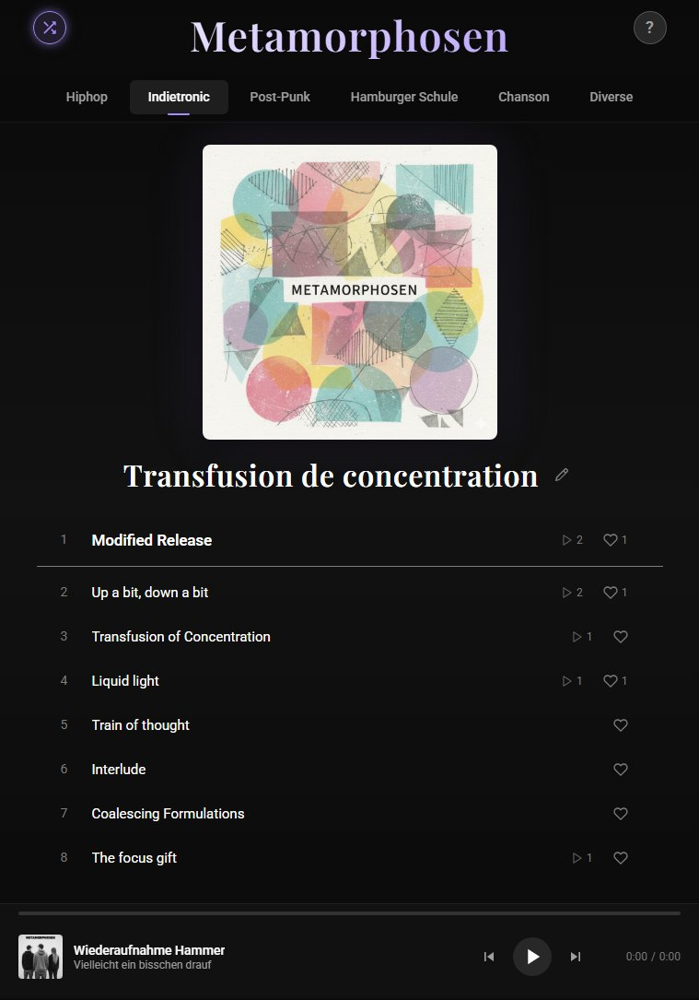

# Metamorphosen

A React-based MP3 album player that you can host on GitHub Pages. Switch up some albums via horizontal tabs. A persistent bottom player keeps audio playing seamlessly across albums. People can like you song and play counts get tracked if you connect a firebase firestore (free tear).



Example built with GitHub Pages:
[https://moebiusst.github.io/Metamorphosen/](https://moebiusst.github.io/Metamorphosen/) 

## Features

- Clean, responsive layout
- Zero backend — fully static, deployable to GitHub Pages

## Genre or Album Slots (in my case... replace with your data)
- **Hiphop**
- **Indietronic**
- **Post-Punk**
- **Hamburger Schule**
- **Chanson**

Labels and track data are fully configurable in `src/data/albums.js`.

## Adding Your Music

1. Place your MP3 files in `public/music/{album-id}/` (e.g. `public/music/hiphop/`)
2. Name them sequentially: `01-trackname.mp3`, `02-trackname.mp3`, ...
3. Add a square cover image as `cover.jpg` in the same folder
4. Edit `src/data/albums.js` and fill in the filenames and track metadata

## Development

```bash
npm install
npm run dev
```

## Deployment to GitHub Pages

### Option 1: Manual via gh-pages

```bash
npm run deploy
```

### Option 2: Automatic via GitHub Actions

Pushing to `main` automatically triggers a build and deployment. Prerequisite: GitHub Pages must be configured to use **GitHub Actions** as the source in your repository settings.

## Tech Stack

- React 19 with Hooks
- Vite
- Global CSS with Custom Properties
- gh-pages / GitHub Actions for deployment
